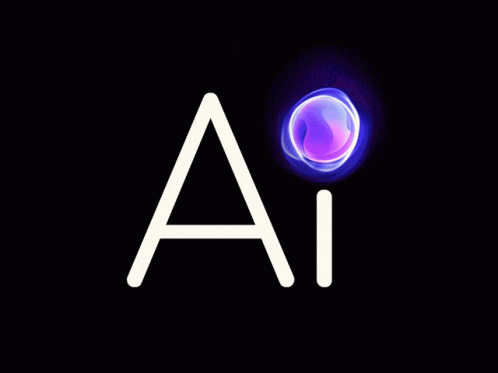

<div align="center">
  <h1>AI & LLMs: Building Intelligent Assistants and Chatbot Frameworks</h1>
  
</div>


Welcome to the **AI & LLMs** project repository! This project is dedicated to exploring and developing next-generation AI assistants and chatbot frameworks powered by Large Language Models (LLMs). Whether you’re a developer eager to experiment with cutting-edge AI or a business looking to integrate intelligent assistants into your workflow, this repository is your starting point.


---

## Table of Contents

<div align="center">

[](#introduction)
[](#background)
[](#project-overview)
[](#features)
[](#installation)
[](#usage)
[](#architecture)
[](#contributing)
[](#license)
[](#contact)

</div>

---

## Introduction
Large Language Models (LLMs) like GPT-4, Claude, Gemini, and others have transformed how machines understand and generate human-like text. These breakthroughs have paved the way for robust AI assistants and dynamic chatbot frameworks that can understand context, generate creative responses, and perform complex tasks in real-time.

This repository provides a modular, scalable, and customizable framework to build, test, and deploy AI-powered tools and intelligent assistants.

---

## Background
LLMs are deep learning models trained on vast datasets and designed to process and generate natural language. Their ability to understand context and produce coherent text has revolutionized:
- **Conversational AI:** Creating chatbots that interact naturally with users.
- **Content Generation:** Automating tasks like article writing, summarization, and translation.
- **Customer Support:** Powering virtual assistants to answer queries 24/7.
- **Personalization:** Delivering tailored user experiences across platforms.

By leveraging these models, developers can build applications that not only automate routine tasks but also enhance human-computer interactions.

---

## Project Overview
This project aims to provide a comprehensive platform for:
- **Developing AI Assistants:** Build assistants that can help with everyday tasks, answer questions, and even manage schedules.
- **Chatbot Frameworks:** Create chatbots for customer service, sales, or educational purposes.
- **Integrating Multiple LLM Providers:** Easily switch between or combine services like OpenAI, Anthropic, Google Gemini, and others.
- **Customization & Scalability:** Tailor the framework to your needs, whether it’s for research, experimentation, or production use.

---

## Features
- **Multi-Model Integration:** Connect to various LLM providers and choose the best model for your use case.
- **Real-Time Interactions:** Enjoy responsive and interactive AI assistant capabilities.
- **Customizable Workflows:** Adapt the chatbot’s behavior with simple configuration changes.
- **Scalable Architecture:** Designed to handle a growing number of users and complex interactions.
- **User-Friendly Interface:** Includes both a developer-friendly API and an intuitive user interface for end-users.
- **Extensive Documentation:** Step-by-step guides to help you set up, customize, and extend the framework.

---

## Installation

### Prerequisites
- **Git** – for cloning the repository.
- **Node.js or Python** – depending on the implementation (adjust instructions accordingly).
- **Docker (optional)** – for containerized deployment.
- API keys for your chosen LLM provider(s).

### Steps

1. **Clone the Repository:**
   ```bash
   git clone https://github.com/yourusername/ai-llm-assistants.git
   cd ai-llm-assistants
   ```

2. **Install Dependencies:**
   - For a Node.js project:
     ```bash
     npm install
     ```
   - For a Python project:
     ```bash
     pip install -r requirements.txt
     ```

3. **Configure Environment Variables:**
   Create a `.env` file in the project root and add your configuration details and API keys:
   ```dotenv
   API_KEY=your_llm_api_key_here
   PORT=3000
   ```

4. **Run the Application:**
   - For Node.js:
     ```bash
     npm start
     ```
   - For Python:
     ```bash
     python app.py
     ```

---

## Usage
After installation, navigate to `http://localhost:3000` (or the port specified in your configuration) to access the application. You can:

- **Interact with the AI Assistant:** Type in your queries and commands to see real-time, intelligent responses.
- **Customize Responses:** Modify configuration files or extend functionality via plugins and modules.
- **Monitor Activity:** Use integrated logging and analytics to monitor performance and user interactions.

---

## Architecture
The project follows a modular architecture to ensure flexibility and ease of extension:

- **Frontend:** A responsive user interface for interacting with the AI assistant.
- **Backend:** Handles API requests, communication with LLM providers, and session management.
- **Middleware:** Acts as an intermediary to process requests/responses and maintain conversation context.
- **Database:** (Optional) Stores user data, configurations, and conversation logs for further analysis.

---

## Contributing
We welcome contributions from the community! If you’d like to help improve this project:
1. **Fork the Repository.**
2. **Create a New Branch:**
   ```bash
   git checkout -b feature/your-feature-name
   ```
3. **Commit Your Changes:** Follow best practices and include detailed commit messages.
4. **Push to Your Branch and Open a Pull Request.**

Please review our [CONTRIBUTING.md](CONTRIBUTING.md) for detailed guidelines.

---

## License
This project is licensed under the MIT License. See the [LICENSE](LICENSE) file for details.

---

## Contact
For questions, suggestions, or feedback, please open an issue on GitHub or contact us at [email@example.com](mailto:email@example.com).

---

Happy Coding!  
*The AI & LLM Assistants Team*

